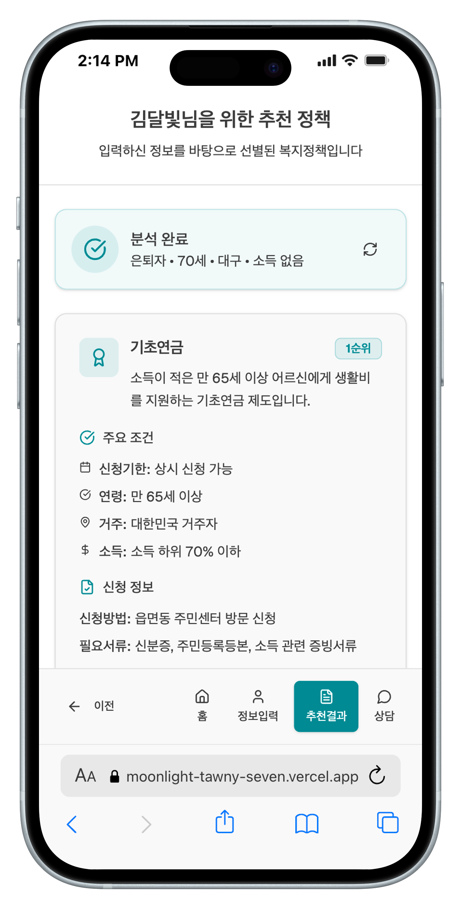

# 📃 개요

## 📌 빠른 이동 (Table of Contents)
- [📃 개요](#overview)
  - [🔗 GitHub 레포지토리 및 시연 영상](#links)
  - [🧾 한 줄 소개](#one-liner)
- [🔥 개발 동기](#motivation)
- [📉 문제 인식](#problem)
- [📊 실태 조사 및 통계 근거](#stats)
- [💡 해결 방향](#solution)
- [🚀 우리가 만드는 변화](#impact)
- [📚 참고 근거](#references)
- [🛠 개발한 서비스에 대한 설명](#product)
- [🔎 우리 서비스의 차별점](#diff)
- [📌 주요 흐름](#flow)
- [✨ 핵심 기능](#features)
- [🚀 향후 발전 계획 (Roadmap)](#roadmap)
- [⚙️ 개발 환경 및 방법](#stack)
- [🛠 개발 방법론 & 핵심 구현 포인트](#method)
- [📑 기능 명세서](#spec)
- [📐 시스템 아키텍처](#arch)
- [📲 앱 흐름 요약](#appflow)
- [👥 팀 & 역할](#team)

---

## 🎯 프로젝트명: 복지찾기
### AI 기반 취약계층 지원사업 맞춤 추천 플랫폼  
(앱 이름: **복지찾기**, 팀 이름: **달빛천사**)

---

## 🔗 GitHub 레포지토리 및 시연 영상
- GitHub: https://github.com/sorocode/moonlight  
- 최종 앱 시연 영상:
  
  > (캡션: '복지찾기' 앱의 온보딩부터 정보 입력, AI 추천 결과 확인, 챗봇 상담까지 전체 흐름을 담은 시연 영상입니다.)

---

## 🧾 한 줄 소개
간편한 입력폼 또는 친절한 AI 챗봇을 통해 개인 상황을 알려주면, AI가 가장 적합한 지원사업 **3가지**를 우선순위로 추천하고 신청 방법까지 한눈에 알려주는 **디지털 포용형 복지 플랫폼**.

---

# 🔥 개발 동기

대한민국은 매년 중앙정부와 지자체가 수천 건의 지원사업을 집행하지만, 정작 필요한 사람에게 닿지 않는 ‘신청주의 복지의 역설’이 반복되고 있습니다.  
정보는 여러 채널에 흩어져 있고 공고문은 행정 용어로 가득합니다. 특히 **어르신·저학력자·디지털 소외계층**에게는 정보 접근과 이해, 실행이 모두 높은 진입장벽입니다.

---

## 📉 문제 인식

- **신청주의 복지의 한계**  
  제도는 존재하지만 대상자가 몰라서 신청하지 못해 수혜로 이어지지 않음.
- **높은 탐색·이해 비용**  
  복지로/지자체 홈페이지/공고문 PDF 등 다채널로 흩어져 있으며, 행정용어 중심이라 이해가 어려움.
- **디지털 격차**  
  온라인·모바일 기반 서비스가 오히려 고령층·저학력층·디지털 비숙련자에게 또 다른 장벽이 됨.

---

## 📊 실태 조사 및 통계 근거

- **경기도 가족돌봄 청소년·청년 실태조사(2025, 도 차원 첫 조사)**  
  - **65.8%**: “한 번도 공공 복지지원을 받지 못했다”  
  - **43.5%**: “지원이 있는지 몰라서”  
  - **20.7%**: “어디로 연락해야 할지 몰라서”  
  - 특히 **13~19세 청소년**에서 정보 접근률이 가장 낮게 나타남  
  - [경기일보, 2025-03-19 승인](https://www.kyeonggi.com/article/20250318580237)  

- **민간 연구(월드비전 × 연세대, 2024)**  
  - 가족돌봄 청소년 58.5%가 지원을 이용한 적 없음  
  - 주요 이유: **‘무슨 서비스가 있는지 몰라서’(54.1%)**, **‘어떻게 신청해야 할지 몰라서’(24.7%)**

- **보건복지부 전국 조사(2022)**  
  - 가족돌봄 청소년의 **우울감 유병률 61.5%**, 일반 청소년(8.5%)의 7배  
  - 주돌봄자의 경우 70.9%로 더 심각  
  - 이는 단순한 정보 접근 문제를 넘어 **정서적·경제적 빈곤으로 직결**됨

➡️ 즉, **“몰라서 못 받는” 구조적 문제**가 반복적으로 확인되고 있으며, 이를 해결하지 않는 한 지원사업의 효과는 크게 제한됩니다.

---

## 💡 해결 방향

1. **중앙화된 정보 허브**  
   흩어진 정책·공고를 한곳에 모아 누구나 쉽게 접근.
2. **개인 맞춤형 추천**  
   사용자의 상황(지역/연령/소득/직업 등)을 반영해 가장 유리한 **상위 3개 사업**을 우선순위로 제시.
3. **쉬운 언어 변환**  
   공고문을 AI가 일상 언어로 번역해 누가/무엇을/언제/어디서를 직관적으로 제공.
4. **투트랙 입력(간편폼 + AI 챗봇)**  
   디지털 숙련도에 따라 입력 방식을 선택 → **디지털 포용 실현**.

---

## 🚀 우리가 만드는 변화

- 정보의 **탐색 → 이해 → 실행** 전 과정을 단순화하여 **실제 신청·수혜율 상승**.
- ‘검색’이 아닌 **‘추천’ 중심 UX**로, 사용자가 다 읽고 고르는 수고를 AI가 대신.
- 장기적으로는 공공 마이데이터 연계 및 원터치 간편신청으로 확장,  
  **정책–현장–당사자**를 매끄럽게 잇는 **디지털 포용 인프라** 구축.

---

## 📚 참고 근거

- [경기일보, 「지원사업 몰라서…‘10명 중 6명’ 도움 못 받았다 [그림자 가장이 산다④]」 (2025-03-19 승인)](https://www.kyeonggi.com/article/20250318580237)  
- 월드비전 × 연세대학교 복지국가연구센터, 「돌봄 청소년 맞춤형 지원 체계 수립 연구」, 2024   

---

# 🛠 개발한 서비스에 대한 설명

**복지찾기** 는 사용자가 최소한의 정보(지역, 나이, 직업, 소득 등)를 입력하거나, 자유 텍스트 대화를 통해 자신의 상황을 설명하면 AI가 자동으로 프로필을 완성하고, **가장 적합한 지원사업 Top 3**를 우선순위로 추천해주는 플랫폼입니다.

---

## 🔎 **우리 서비스의 차별점 (복지로 등 기존 사이트 대비)**

| 구분 | 기존 포털 사이트 (복지로 등) | **혜택찾기** |
| --- | --- | --- |
| **정보 제공 방식** | 사용자가 직접 필터링하는 '검색' | AI가 최적안을 제시하는 **'추천'** |
| **결과 형태** | 조건에 맞는 사업 '목록' 전체 | 개인에게 가장 유리한 **'우선순위 3개'** |
| **정보 입력 방식** | 복잡한 필터링 UI (GUI) | **'간편폼' + 'AI 챗봇' (투트랙)** |
| **언어 및 가독성** | 행정 용어, 공고문 원문 | AI가 번역한 **'쉬운 일상 언어'** 및 시각화 |
| **핵심 가치** | 정보의 집합 및 검색 기능 제공 | **디지털 포용** 및 **정보 접근성 극대화** |

---

## 📌 주요 흐름

1. **사용자 입력**  
   - 간편 입력폼 (선택형 UI)  
       
   - AI 상담 챗봇 (자유 텍스트)  
     

2. **정보 추출**  
   - 정규식 기반 엔티티 추출  
   - 부족한 항목은 LLM 보정 (Fail-Fast & Fallback)

3. **추천 생성**  
   - 동적 프롬프트 기반 LLM 호출  
   - **Top 3 지원사업**을 구조화된 정보(조건·서류·방법 등)와 함께 반환

4. **결과 제공**  
   - 공고문을 **쉬운 언어**로 변환  
   - 신청기한, 필요서류, 신청방법 한눈에 제공

---

## ✨ 핵심 기능

- **간편 프로필 입력 (앱/웹)**: 최소 입력으로 프로필 완성  
- **하이브리드 정보 추출**: 정규식 + LLM 보정  
- **AI 맥락 기반 추천 (Top 3)**: 프로필 전체 맥락 반영  
- **쉬운 언어 변환**: 공고문을 “누가/무엇을/언제/어디서” 형식으로 요약  
- **대화형 챗봇 입력**: 자유 텍스트 입력 지원  

---

# 🚀 **향후 발전 계획 (Future Roadmap)**

'복지찾기'는 단순한 추천 서비스에 머무르지 않고, **대한민국 대표 디지털 포용 복지 플랫폼**으로 확장해 나갈 계획입니다.

- **1단계 (서비스 고도화)**  
  사용자 피드백을 반영해 **추천 알고리즘을 개선**하고, 더 많은 지자체 지원사업 데이터를 확보하여 추천의 정확성과 신뢰성을 높입니다.

- **2단계 (접근성 강화)**  
  **음성 입력(STT) 기능**을 추가해 텍스트 입력이 어려운 어르신·장애인 등 디지털 소외계층도 쉽게 이용할 수 있도록 합니다.

- **3단계 (플랫폼 확장)**  
  중앙정부·지자체 API와 연동해 **원터치 간편 신청**을 지원하고, 장기적으로는 주민센터·사회복지관 등과 연결되는 **통합 복지 플랫폼**으로 발전시킵니다.

---

# ⚙️ 개발 환경 및 방법

## 📚 Stack & Tools

### Web
 
 

### App(WebView)

### AI
  

### Python (AI 추천엔진)
  
  
- Google Colab 환경에서 개발  
- 정규표현식(`re`) 기반 NLU 파이프라인  
- OpenAI GPT API 연동 → **추천 결과(JSON) 보장 출력**  

### Deploy

### Cooperation
 

---

## 🛠 개발 방법론 & 핵심 구현 포인트

- **투트랙 입력 처리**: 간편폼 → JSON / 챗봇 → 규칙 추출 + GPT 보정  
- **Fail-Fast & Fallback**: 정규표현식(1ms) + LLM 슬롯 필링  
- **AI 추천 엔진**: 동적 프롬프트, JSON 강제 출력, `temperature=0.2` 고정  
- **신뢰성 최적화**: 규칙 기반 우선 처리, LLM 최소 호출  
- **접근성 강화**: 큰 글씨·아이콘 중심 UI, 향후 STT 확장  

---

# 📑 기능 명세서 (Feature Specification)

### 1) 간편 프로필 입력 (앱/웹)
- 입력: 지역, 연령, 성별, 직업, 소득  
- UI: 드롭다운 + 라디오 버튼  
- 출력: JSON 프로필  

### 2) AI 상담 챗봇
- 입력: 자유 텍스트 (예: “나는 대구 사는 68살 할머니”)  
- 처리: 규칙 추출 → GPT 보정  
- 출력: JSON 프로필  

### 3) 추천 엔진 (Top 3)
- 입력: JSON 프로필  
- 출력: 사업명, 조건, 기한, 서류, 방법, 링크 (JSON)  
- 안정성: JSON 스키마 강제, 오류 시 재시도  

### 4) 쉬운 언어 변환
- 입력: 공고문  
- 출력: “누가/무엇을/언제/어디서” 요약  

### 5) 결과 화면 & 액션
- UI: Top 3 카드, 자세히 보기 / 신청하기  
- 기능: 단계별 가이드, 자료 내보내기  

### 6) 관리자/백오피스 (향후)
- 기능: 공고 수집·검수·DB 관리  

---

# 📐 시스템 아키텍처

  
> 입력 → NLU(규칙→LLM) → 추천 엔진 → 결과 제공

---

# 📲 앱 흐름 요약
1. 온보딩  
2. 입력(폼/챗봇)  
3. 프로필 완성 → 추천  
4. Top 3 카드 표시  
5. 신청 가이드 연결  

---

# 👥 팀 & 역할
- **팀명**: 달빛천사  
- 남상혁 : **팀장**, AI 추천엔진 & NLU 파이프라인 구현(프롬프트 엔지니어링 포함), README 문서 작성  
- 김성현 : **웹·앱 프론트엔드 개발 (Next.js & React Native)**, UI 구현, UX 기획 지원  
- 김민균 : **영상 편집 및 데모 제작**, UI 개선, 발표 자료 준비 및 최종 발표
  
